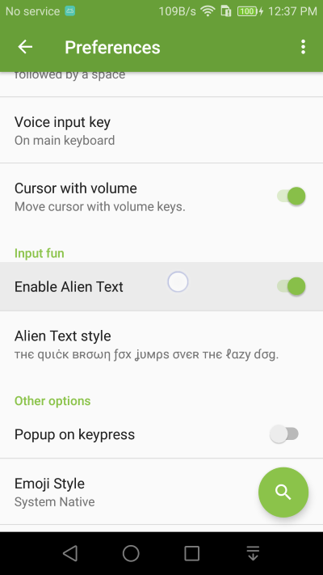
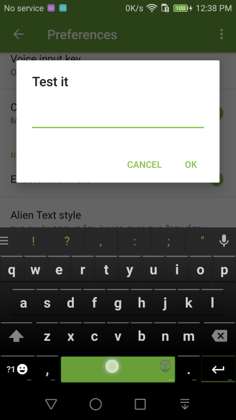
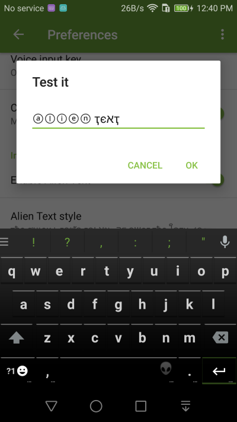

Alien Text
===============

𝕬𝖑𝖎𝖊𝖓 𝖙𝖊𝖝𝖙 𝕒𝕝𝕝𝕠𝕨𝕤 𝕪𝕠𝕦 тσ тєχт ɨn sŧɏłɇ, ⓛⓘⓚⓔ ⓣⓗⓔⓢⓔ

1. Go into **Preferences** Settings and switch on the Enable Alien Text setting

2. After Alien Text is turned on (you will see an alien head showing on the space key), you text input will be automatically changed to "alien text". You can quickly switch to other alien text style or change back to normal text style by long pressing the space key.

3. Try it, it's fun!

