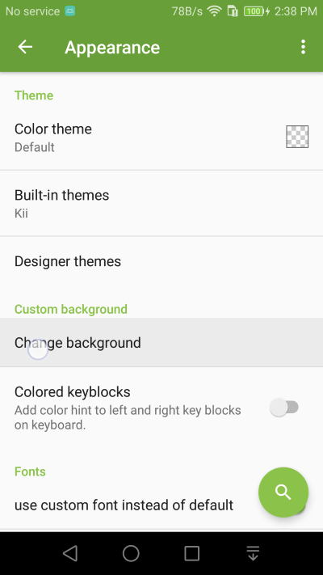
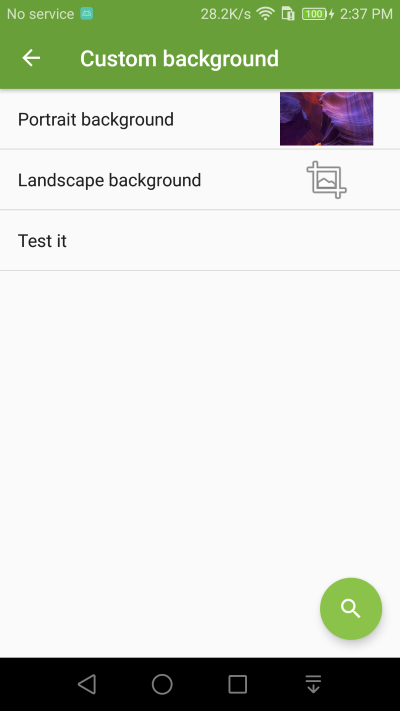

Keyboard Background
===============

Personalize Kii Keyboard with your own photo or favorite pictures as the keyboard background. 

1. Go to **Appearance** setting and select **Change background** setting.

2. You can choose any images or photo on your devices as the keyboard background.

.. image:: _static/img/background3.png
