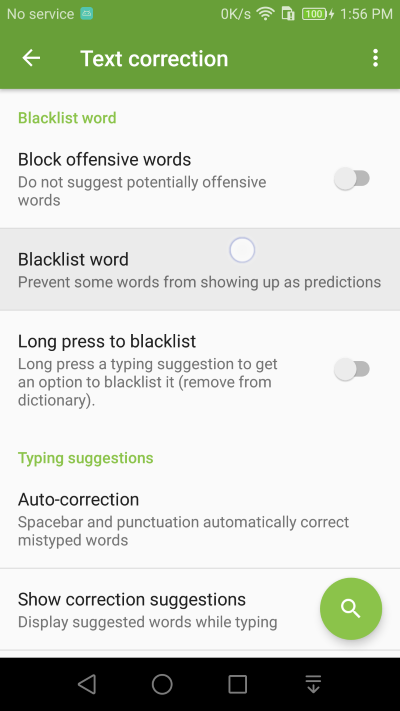
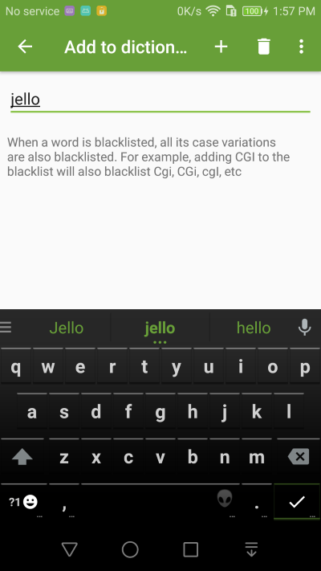
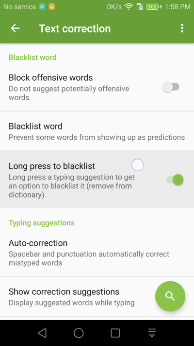
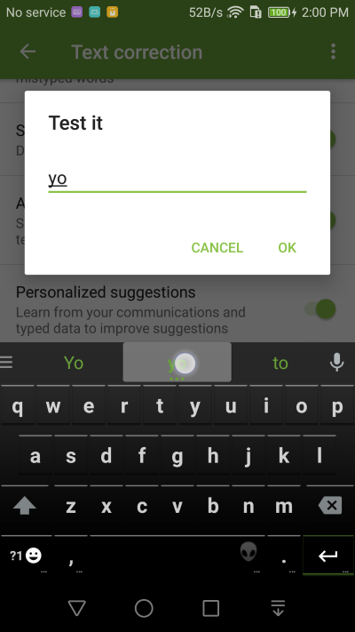
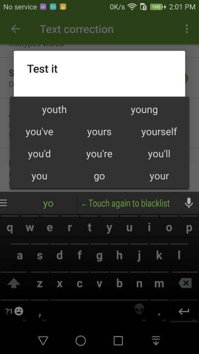

Blacklist Word
===============

Blacklisting a word means removing a word from showing up as a typing suggestions. You can still type it but the prediction engine won't provide it as a typing suggestiong. 

1. Go into **Text correction** Settings and select **Blacklist word** setting

2. Add the word you want to blacklist (remove from main dictionaries). For example, if you often mis-type hello as jello, blacklist the word jello.

3. Alternatively, you can enable the Long press to blacklist setting.

4. Then you can press and hold a word on the suggestion bar to get an option to blacklist the word.

