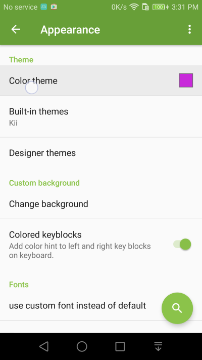
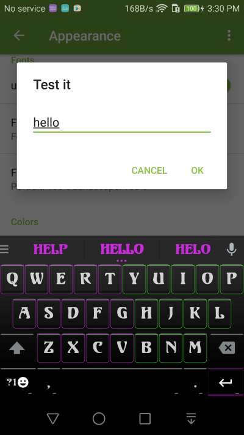
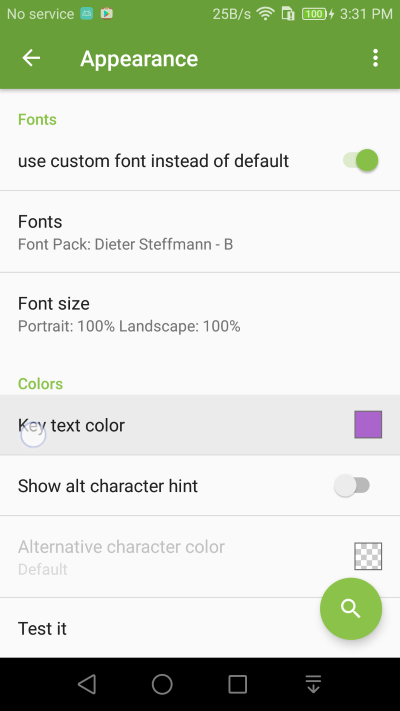
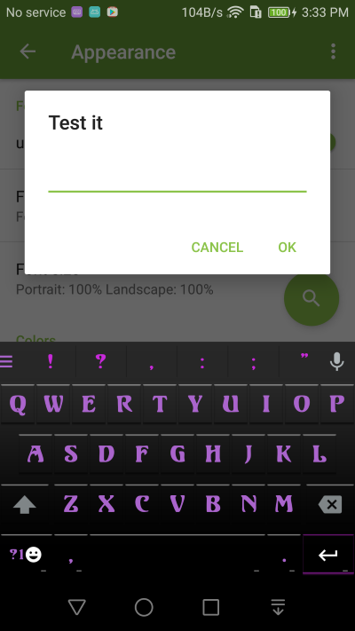

Keyboard colors
===============

There are many ways to change how Kii Keyboard look. The easiest way is to change the overall theme color. 

1. Go to **Appearance** setting and change color theme

2. You can change the color of the keyboard text

