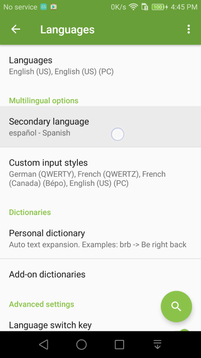
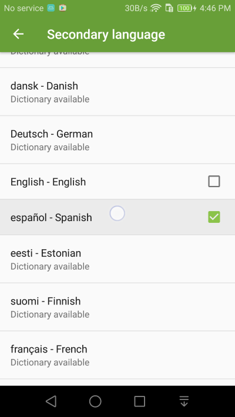
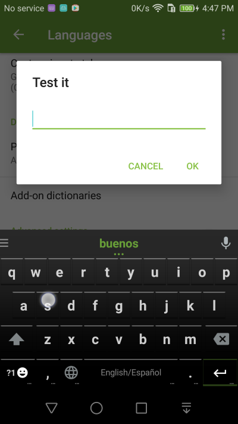

Dual Language Input
===============

Do you speak more than 1 language? Enable the secondary language setting to type in two languages. 

1. Go into **Language** settings and choose **Secondary Language** setting

2. Enable one of the listed languages as a **secondary language**.

3. You will see both your **primary language** and **secondary language** listed on the space key. The keyboard layout will follow your primary language setting, but words from both languages will show up as typing suggestions.

