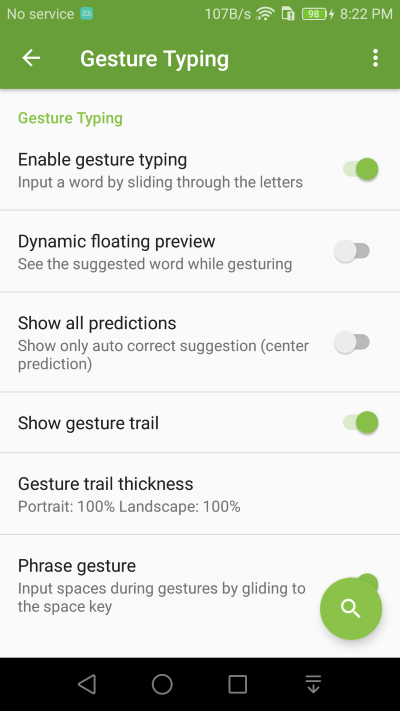
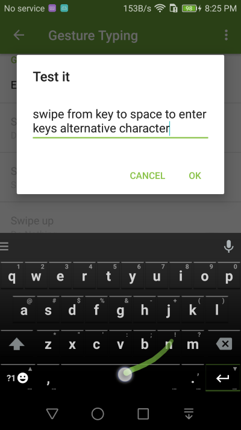

Extra Keyboard Rows
===============

Gesture Input is enabled by default, you can turn it off in setting if you don't use it. 

1. You can also turn on some extra features in setting such as floating preview, and gesture shortcuts

2. When gesture input is enabled, you can slide your finger over the keyboard to gesture type. 

.. image:: _static/img/gesture2.png

3. When you slide from a key to the space key, the key's alternative character will be entered. For example, slide from from 'n' to space to get '!'.

