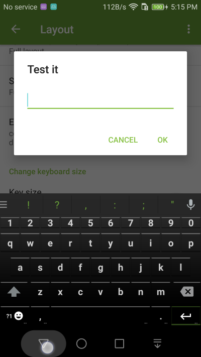
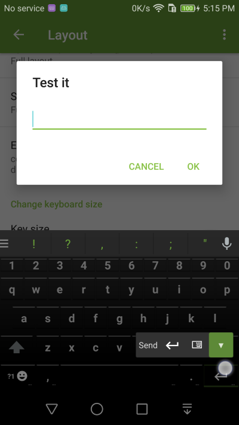

Hide keyboard
===============

1. To hide (dismiss) Kii Keyboard, click the Back button on your android devices. 

2. Alternatively, you can press and hold the Enter key and choose the hide keyboard function (down arrow).

