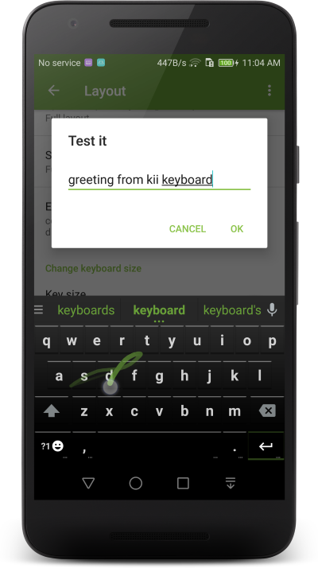

.. PokiiMap documentation master file, created by
   sphinx-quickstart on Mon Aug 29 14:28:11 2016.
   You can adapt this file completely to your liking, but it should at least
   contain the root `toctree` directive.

Kii Keyboard 2
====================================

About
##################

**Kii Keyboard 2** is an alternative keyboard on Google Android. It's the sucessor of the original popular Kii Keyboard, love by millions of users. 

Kii Keyboard 2 is free. Our goal is to create the best keyboard app for both Android phones and tablets. 

Get the latest release `HERE`_

.. _HERE: download.html

Features
##################

Kii Keyboard 2 is currently in active development and beta testing, all features are completely free to use. 

* Emoji Keyboard: support messaging emoji to ios and android
* Best all-in one keyboard optimized for both phone and tablets
* Accurate and smart keyboard predictions
* User defined text shortcuts
* Extra number key row
* Extra arrow key row
* Next word prediction
* Gesture keyboard control
* Gesture input
* Split keyboard layouts
* Support many keyboard layouts: PC, Compact qwerty, T9, Dvorak, Azerty, Colemak
* 6 build-in HD themes
* Support a variety of themes types: Go Keyboard theme, iKeyboard theme,  Themeshop Keyboard, CM10 themes
* Font and color customization
* Use any pictures as keyboard background
* True Multi-touch keyboard
* Based on the latest Android Nougat AOSP keyboard

How-to
##################
.. toctree::
   :maxdepth: 2
   :titlesonly:
   :caption: Basic usage
   
   hide
   special
   shortcut
   faq
   
.. toctree::
   :maxdepth: 2
   :titlesonly:
   :caption: Text input
   
   dual
   select
   blacklist
   alientext
   
.. toctree::
   :maxdepth: 2
   :titlesonly:
   :caption: Size & layout
      
   size
   padding
   layout
   row
   inputstyles
   
.. toctree::
   :maxdepth: 2
   :titlesonly:
   :caption: Customization
         
   theme
   background
   fonts
   color
   
   
   
   
Screenshots
##################

