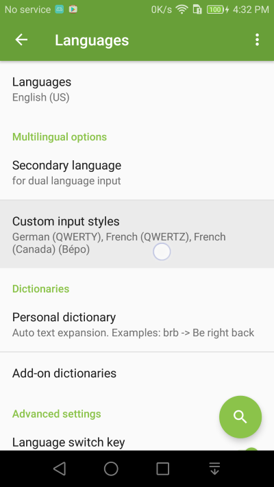
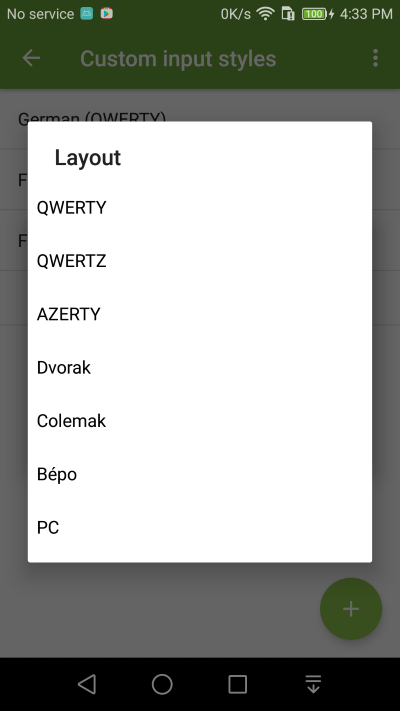
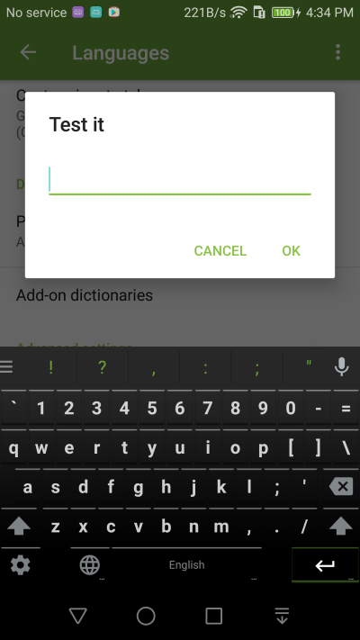

Custom Input Styles: PC, Qwertz, Azerty, Dvorak, Coleman, etc
===============

1. Go into **Language** Settings and select the Custom input styles setting

2. You can add a different input style for the language of your choice. For example, add the PC layout for English

3. Switch to the custom input layout using the language switch key

