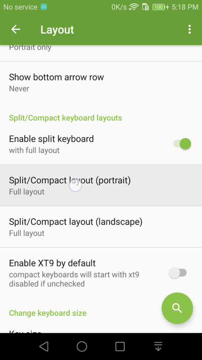
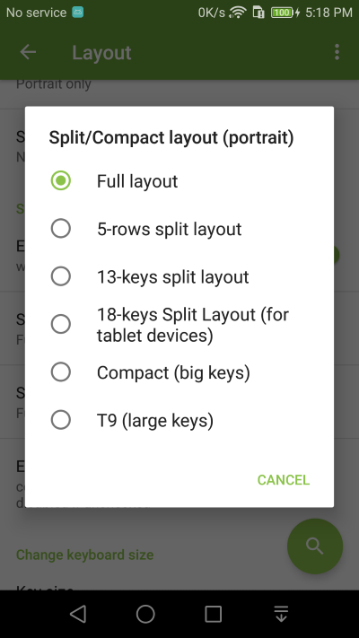
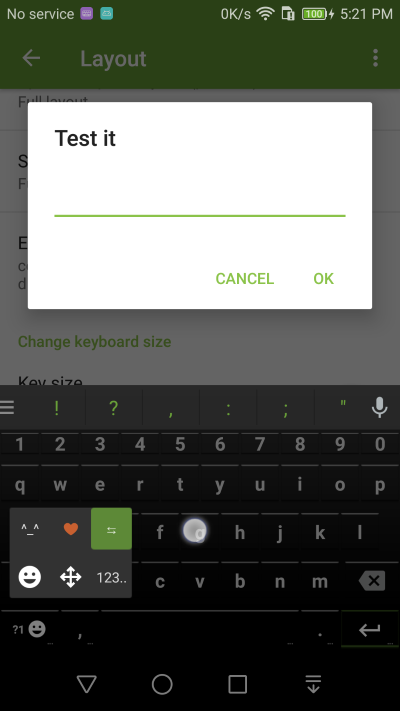
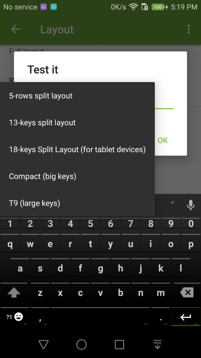

Split Layouts, Compact Layouts, T9
===============

1. Go into **Layout** Settings and select the Split/Compact layout setting

2. Choose one of the different layouts from the list.

3. You can also quickly switch to different layouts using the quick layout switch function accessible in the popup keyboard of the ?1 key (long press ?1 key to see it). 

