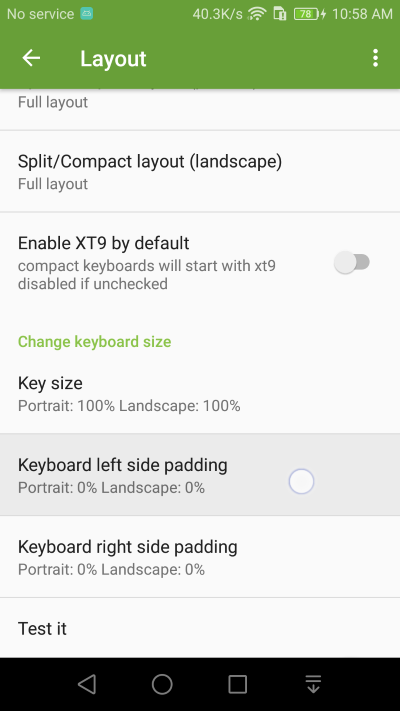
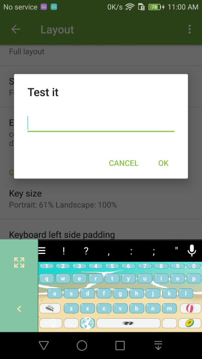

Keyboard Padding
===============

Having troubles reaching all the keys one handed? Make the keyboard smaller by adding spacing left or right side of the keyboard. 

1. Go into **Layout** Settings and select the Keyboard Padding setting

2. You can add side padding to Kii Keyboard for easier one hand typing on devices with larger screens. 

