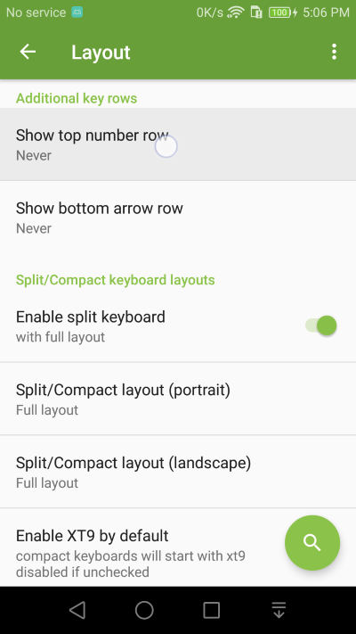
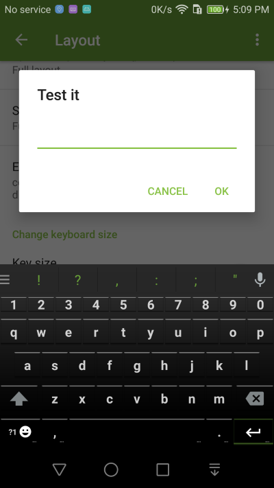

Extra Keyboard Rows
===============

Add extra keyboard rows to Kii Keyboard just like the default keyboard on Samsung and HTC.

1. Go into **Layout** Settings and select the Show number row setting

2. You can add the number row and/or arrow row to Kii Keyboard. 

