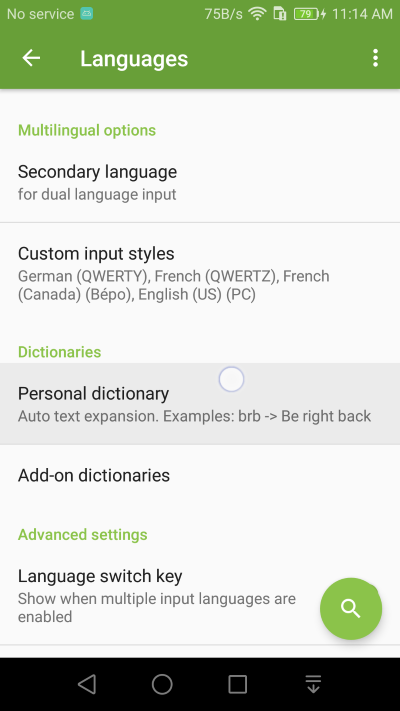
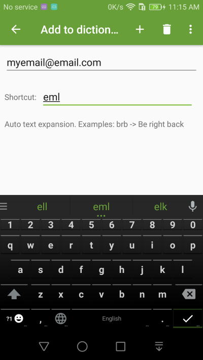
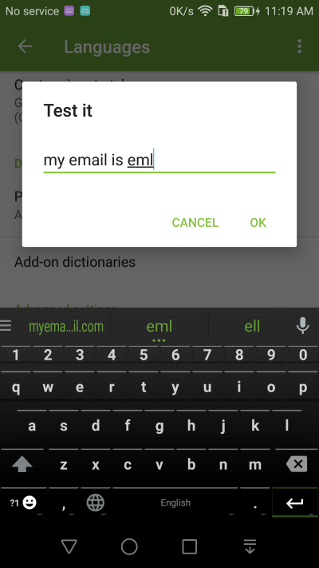

Text Shortcuts
===============

Text shortcuts are now under **Personal dictionary** setting. It allows you to add text shortcuts for any text such as email addresses, short phrases, etc.

1. Go into **Language** Settings and choose the **Personal dictionary** setting 

2. Enter a text shortcut, for example, use 'eml' as a shortcut to your email address.

3. Then instead of typing your email every time, you can simply type 'eml' to get your email address.

