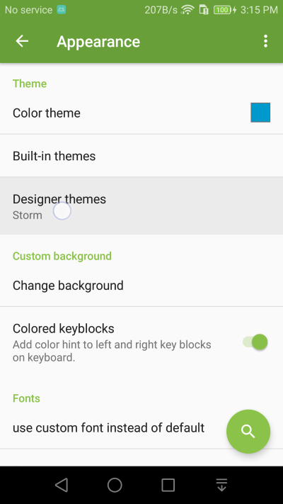
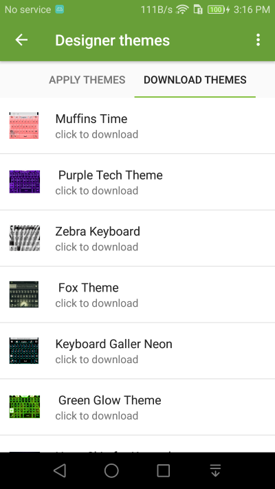
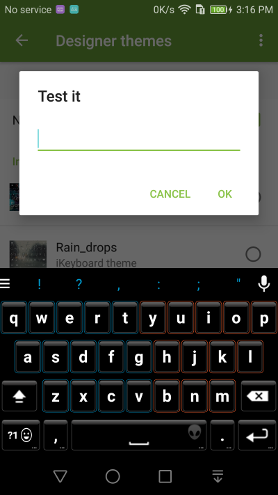

Keyboard Theme
===============

1. Go to **Appearance** setting and select **Designer themes** setting.

2. If you have keyboard themes available on your devices, they will show, otherwise, use the Download Themes tab to download one (or a few) first.

3. Once you have the keyboard theme installed, come back to the Designer Theme setting and apply them.

